# 1. Introduction

This lesson is all about the Robot Operating System or ROS for short. ROS is widely used across the industry and academia for building robotics applications. ROS is an Open Source Robotics framework that provides libraries and tools for working with hardware and for passing messages between components. ROS also has tools for visualization, simulation and analysis as well as extensive community support and an interface to numerous powerful software libraries. 

# 2. Brief History of ROS

Development of ROS began in the mid-2000s as Project Switchyard in Stanford's Artificial Intelligence Laboratory. In 2007, ROS became a formal entity with support from Willow Garage. Since 2013, the Open Source Robotics Foundation has been maintaining and developing ROS.

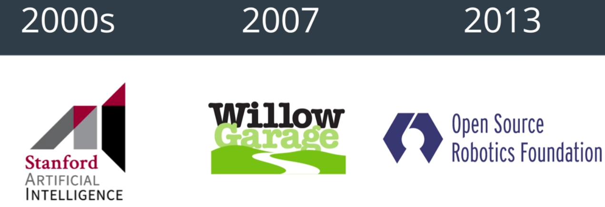

  
One of the primary motivations for developing ROS was the recognition that researchers were constantly reinventing the wheel where there were not many reusable robotics software components that could be used as a starting point for a project. In addition, because different groups were all working on custom solutions, it was difficult for them to share code and ideas, It was also difficult to compare results. ROS aims to facilitate the development process by eliminating these problems.

  
Lots of people and lots of companies use ROS. There are drones, kinematic arms, wheeled robots and even bipedal robots out there using ROS, every day.

# 3. Nodes and Topics

Pretty much all the robots share the same basic characteristics of containing **sensors for perceiving the world around them, software for making high level decisions and motors and controllers for actuation**. ROS provides a powerful communications system allowing these different components (**perception, decision making and actuation components**) to communicate with one another by considering a generic robot. This robot could be a drone, a mobile base or even a robotic arm. While these robots may be composed of very different physical components, they are all built to perform these same three high level steps of **perception, decision making and actuation**.

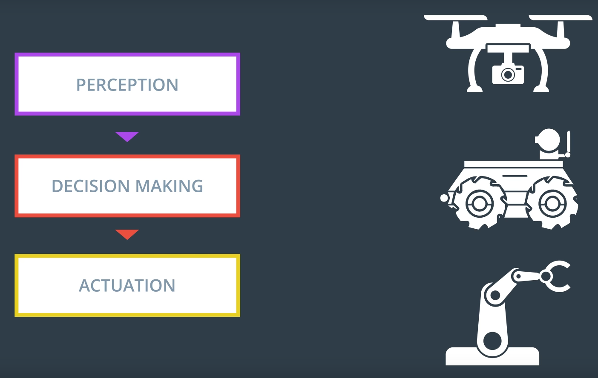

  
On the software side, ROS manages these three complex steps by breaking each of them down into many small unit processes called **nodes**. Typically, each node on the system is responsible for one small and relatively specific portion of the robot's overall functionality.

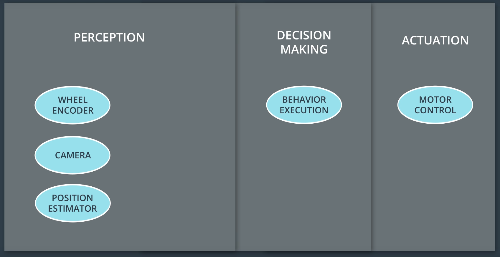

  
For example, there may be nodes for each sensor and actuator in the system as well as nodes for things like position estimation, behavior execution and motor control (See above).

At the center of the collection of nodes is the **ROS Master**, which acts as a sort of manager of all the nodes. The ROS Master maintains a registry of all the active nodes on a system and then allows each node to discover other nodes in the system and establish lines of communication with them. 

Note: The ROS master allows nodes to locate one another but after that they connect with each other directly.
In addition to allowing nodes to locate one another and communicate, the ROS Master also hosts what has called **the parameter server**. As its name suggests, the parameter server is typically used to store parameters and configuration values that are shared amongst the running nodes. For example, a mobile robot's wheel radius may be used by one node to estimate position and by another to calculate speed and rather than storing the same information in multiple places, nodes can look up values as needed(See below).

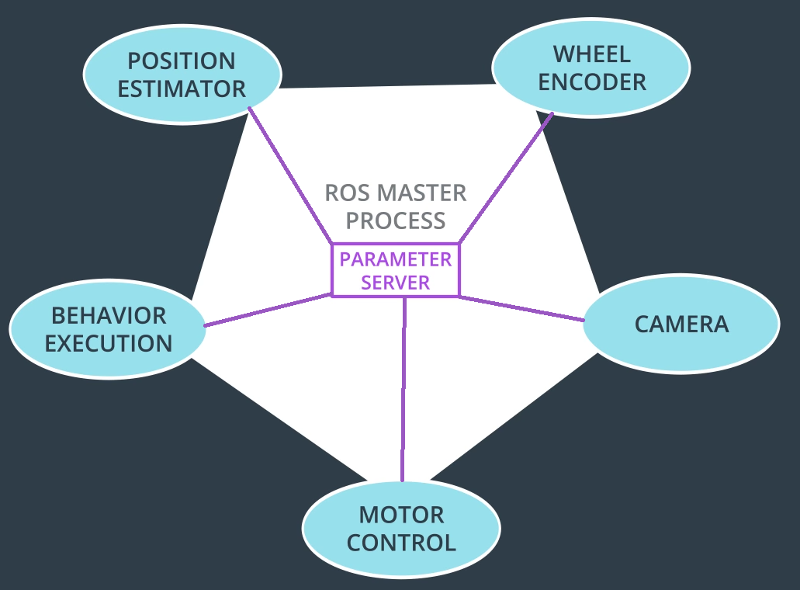

 
Nodes can share data with one another by passing messages over what are called **topics**. A topic is simply a named bus which you can think of as a pipe between nodes through which messages flow. 

**In order to send a message on a topic, we say that a node must publish to it. Likewise, to receive a message on a topic, a node must subscribe to it**. Below is an example of the topics called **publish subscribe or a pub sub architecture** (the arrows represent message flow from publishers to subscribers).

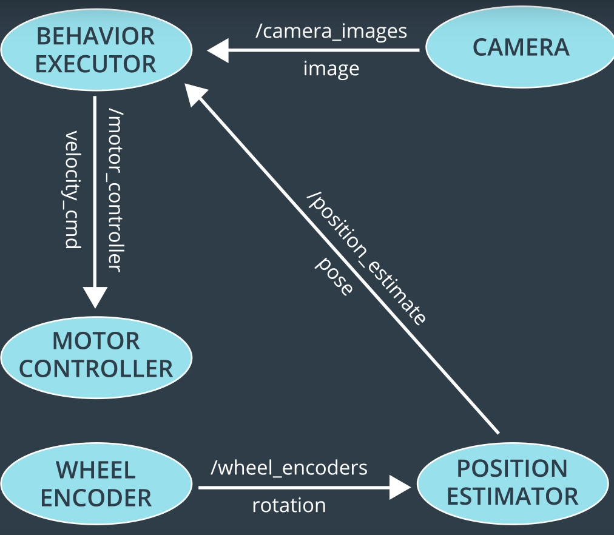

It's important to note that each node may simultaneously publish and subscribe to a wide variety of topics.

# 4. Message Passing Types

Each ROS distribution comes with a wide variety of predefined message types which are available for our use. There are message types for communicating physical quantities, such as positions, velocities, accelerations, rotations and durations. There are also messages for communicating sensor readings such as laser scans, images, point clouds, inertial measurements and more.

The number of message types available in a full ROS install is actually quite staggering and you can to define your own type. It's important to note that although the named messages would seem to imply text based contents, they can in fact contain any kind of data. Below is an example of the message types associated with the topics we looked at earlier.

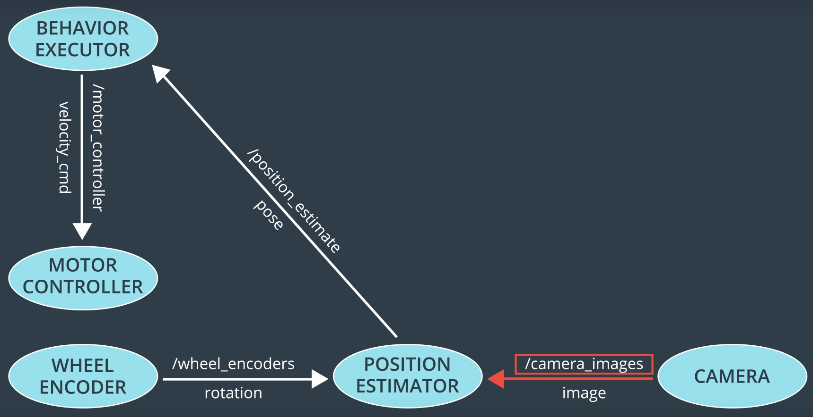

  
In the above case, the topic called camera_images is transporting image messages from the camera node to the position estimator node.

# 5. Services

Passing messages over topics between publishers and subscribers is useful but it's not a one size fits all communications solution. There are times when **a request response pattern** is useful. For these types of interactions, ROS provides what are called **services**.
Like topics, services allow the passing of messages between nodes. However, unlike topics, a service is not a bus and there are no publishers or subscribers associated with them. Instead, nodes interacting via services do on a one to one basis (1-1) using a request and response messages.

Let's take a look at how a service might be used in an example. Let's say that the behavior executor node wants to capture an image from the camera. We could just have it subscribe to the camera images topic. It would then receive a new image each time the camera node publishes one (See below).

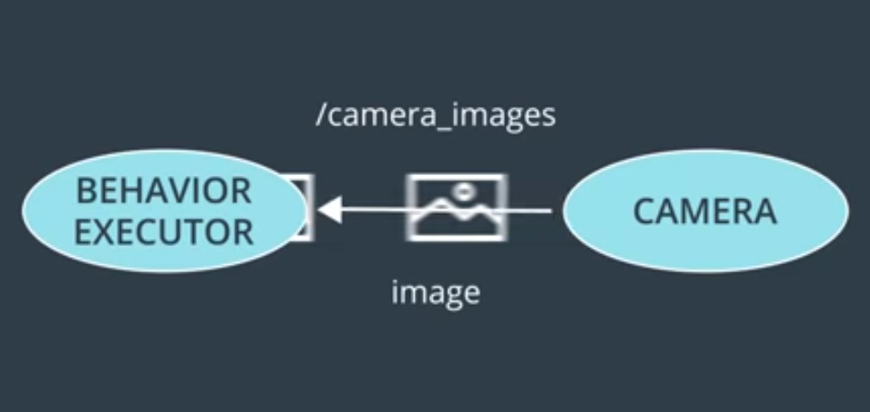

The request message definition might be a custom message type called exposure time(see below) and the response might just be an image message. By issuing a service call to the capture_image service, the behavior executor node is able to request and the camera should capture an image with a given exposure time setting (2 milisecond). The camera node will then respond to the request by sending a message containing the resulting image.

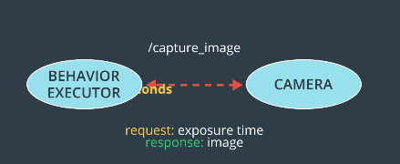

  
# 6. Compute Graph

A moderately complex robot will likely have dozens of nodes even more topics and quite a few services. The diagrams of nodes and topics and how they're all connected are frequently referred to as **compute graphs** (see below image). Visualizing the compute graph is very useful for understanding what nodes exist and how they communicate with one another.
 
  

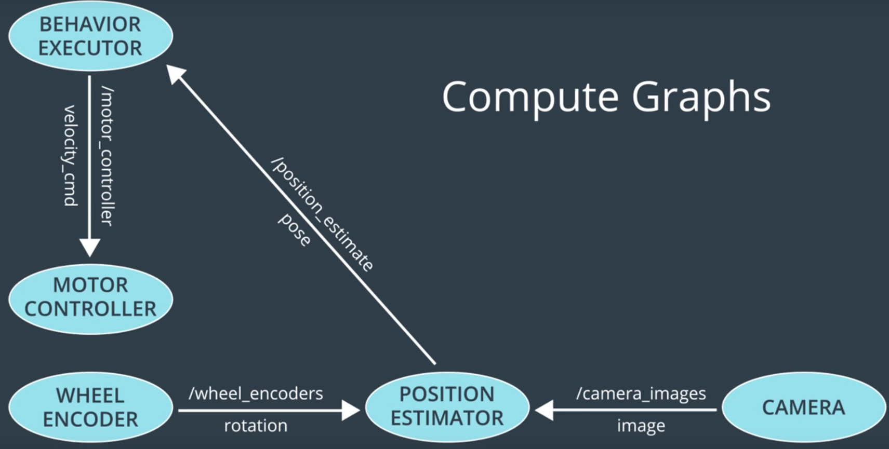

  
Note: ROS provides a tool called **rqt_graph** for showing the compute graph of a system.  

# 7. Turtlesim Overview

In this section we are going to get some hands-on experience with a helpful little simulator package called **TurtleSim**. Actually, the use of turtles and robotics goes back to the 1940s. Early roboticist William Gray Walter created some of the first autonomous devices, turtle robots which he called **Elmer and Elsie** and in the 1960s at MIT, Seymour Papert used turtle robots in robotics education.

  

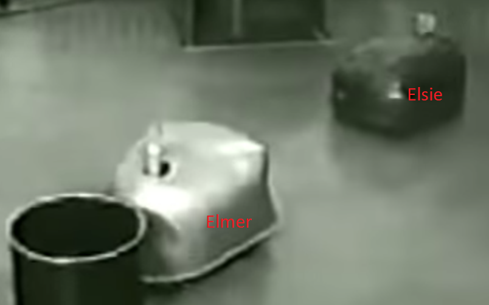

  
 Seymour's robots could perform a few basic functions. They could move forward or backwards by a given distance, rotate by a given angle or they could drop the retractable pen on their bellies allowing them to draw as they moved.
 
In addition to being involved with the creation and development of MIT’s turtle robots, Dr. Papert is also known as the creator and evangelist for the educational programming language **LOGO**.

Despite being a general-purpose language, LOGO is known for its use of [turtle graphics](https://en.wikipedia.org/wiki/Turtle_graphics), a system which allows users to draw by sending simple commands to a robotic turtle. The robotic turtle mentioned here could be either a real turtle robot or a virtual on-screen cursor within the LOGO programming environment.

  

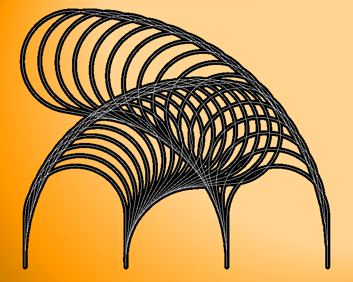

 
The image above depicts some drawings of three dimensional spheres creating using turtle graphics. The website [turtleart.org](http://turtleart.org/) hosts a gallery containing some even more outstanding examples!

If you'd like to have some fun with turtle graphics, feel free to try out the [Turtle Graphics 1.01](https://scratch.mit.edu/projects/1250518/) project, which allows you to experiment with turtle graphics through MIT’s graphical programming environment scratch.

# 8. Install ROS

To follow along with the exercises in these lessons, you will need to be running Ubuntu Linux with ROS installed. download the [compressed VM disk image](https://s3-us-west-1.amazonaws.com/udacity-selfdrivingcar/Udacity_VM_Base_V1.0.0.zip), uncompress and  open it using [VirtualBox](https://www.virtualbox.org/wiki/Downloads) to run the VM(**The password for the VM is udacity-nd**).

To install ROS without using VirtualBox, please visit: [ROS documentation](http://wiki.ros.org/)

# 9. Source the ROS Environment

Before we begin using ROS in a terminal, we must first ensure that all of the environment variables are present. To do this, we must source the setup script provided by ROS:
  
    source  /opt/ros/kinetic/setup.bash
  

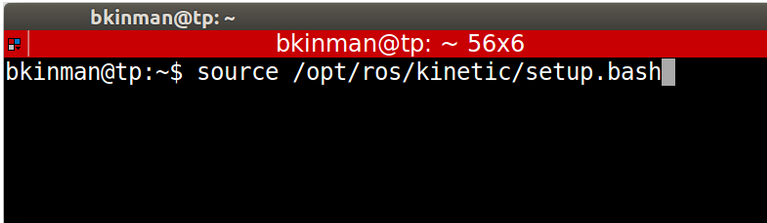

  
Note: source command executes the bash script within the existing environment.

#### Inspecting the Environment

You can inspect the changes that it has made to our environment variables by running the following commands in a new terminal (where source /opt/ros/kinetic/setup.bash has not already been executed before).

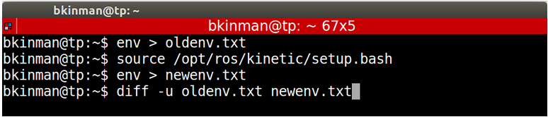

  
More information about the environment variables can be found [here](http://wiki.ros.org/ROS/EnvironmentVariables).

#### Automatically Configuring the Environment

Setting up the ROS environment every time you open a new terminal window can be painful and tedious. To avoid the tedium, we can simply add the command to source the workspace to our ~/.bashrc file. This will cause our environment to be sourced any time a new terminal session is created. Please note that the provided VM already has this configured so there is no need to execute this step!

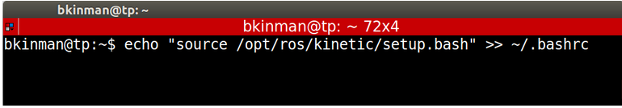

  

# 10. Run Turtlesim

Now that we have added ROS’ environment variables to our terminal session, you can run the turtlesim package but before any ROS nodes can be run, the **Master process** must be started. The Master process is responsible for the following (and more)

* Providing naming and registration services to other running nodes
* Tracking all publishers and subscribers
* Aggregating log messages generated by the nodes
* Facilitating connections between nodes

To run the master process, you must execute the command **roscore**. If all goes well (and it should), you will see an output similar to following:

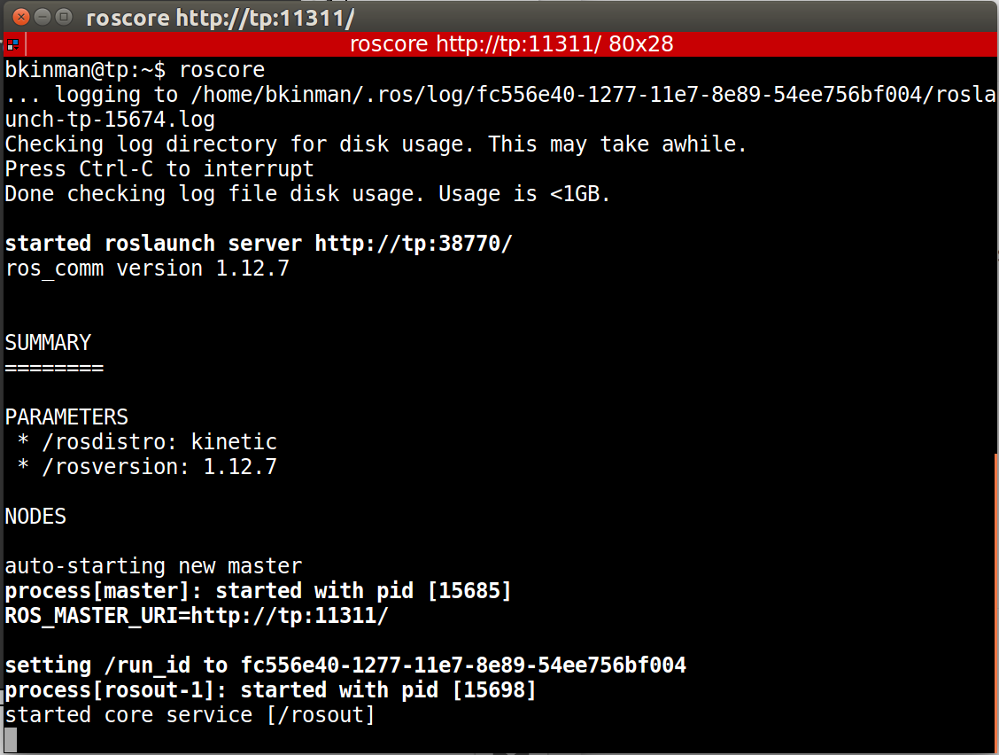

This indicates that ROS Master is running. To terminate the ROS Master process, simply type **ctrl-c** in the roscore terminal window.

# 11. Running Turtlesim Nodes

Now that the ROS master is running, we can run our first two ROS nodes. To do so, we will execute the **rosrun** command in a new terminal window, passing as parameters **the name of the package** we wish to run, and **the name of the actual node**. First we will start the turtlesim_node, in the turtlesim package using the following command.

    rosrun turtlesim turtlesim_node
    
Next, we will start the turtle_teleop_key node from the turtlesim package.

    rosrun turtlesim turtle_teleop_key
    
By using the arrow keys with the turtle_teleop_key node’s console selected, we are able to move the turtle in turtlesim(see below)!

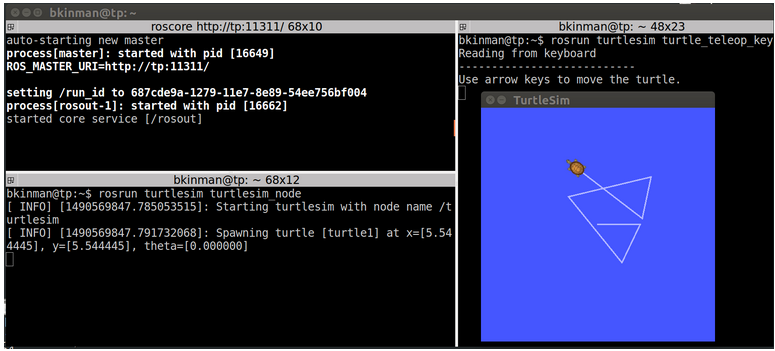

Note: Tab completion is your friend. Each ROS distribution comes with a staggering number of packages and an even more staggering number of nodes. In the bash shell, a single-tap of the tab key will cause the command on the command-line to be completed, if there is a single match. A double-tap of the tab key will result in a list of all possible matches, in the case that a single match cannot be found.

# 12. List All Active Nodes

To get a list of all nodes that are active and have been registered with the ROS Master, we can use the command **rosnode list** in a new terminal . Let’s do now:

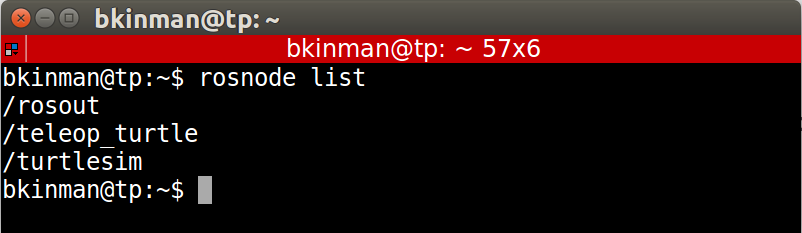

We can see that there are three active nodes that have been registered with the ROS Master, /rosout, /teleop_turtle and /turtlesim.

* /rosout: This node is launched by roscore. It subscribes to the standard /rosout topic, the topic to which all nodes send log messages.
* /teleop_turtle: This is our keyboard teleop node. Notice that it’s not named turtle_teleop_key. There’s no requirement that a node’s broadcasted name is the same as the name of it’s associated executable.

* /turtlesim: The node name associated with the turtlebot_sim node.

# 13. List Topics

In a similar fashion, we are able to query the ROS Master for a list of all topics. To do so, we use the command **rostopic list**.

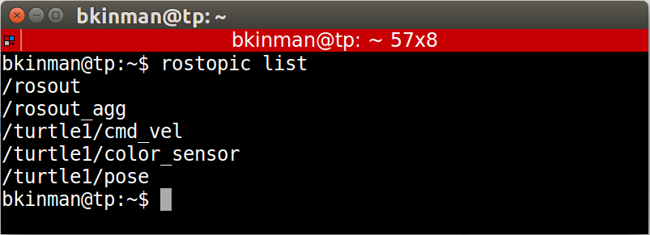

  
* /rosout_agg: Aggregated feed of messages published to /rosout.
* /turtle1/cmd_vel: Topic upon which velocity commands are sent/received. Publishing a velocity message to this topic will command turtle1 to move.
* /turtle1/color_sensor: Each turtle in turtlesim is equipped with a color sensor and readings from the sensor are published to this topic.
* /turtle1/pose: The position and orientation of turtle1 are published to this topic.

# 14. Get Information About a Specific Topic

If we wish to get information about a specific topic, who is publishing to it, subscribed to it or the type of message associated with it, we can use the command **rostopic info**. Let’s check into the /turtle1/cmd_vel topic:

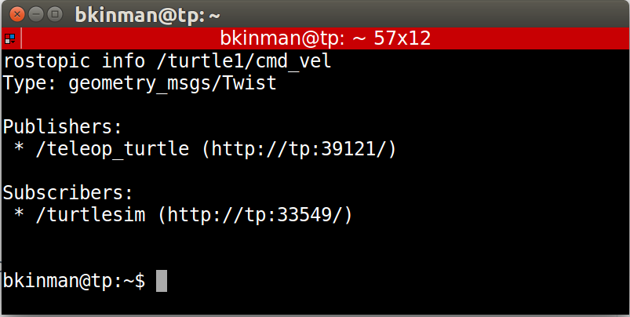

  
 As would be expected, there are two nodes registered on this topic. Our publisher the teleop_turtle node, and our subscriber the turtlesim node. Additionally, we can see that the type of message used on this topic is **geometry_msgs/Twist**.

# 15. Show Message Information

Let’s get some more information about the **geometry_msgs/Twist** message on the **/turtle1/cmd_vel** topic, to do so, we will use the **rosmsg info** command.

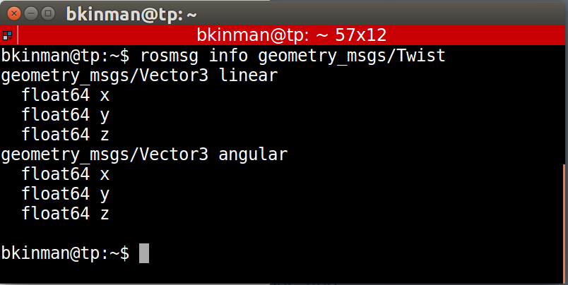

We can see that a Twist message consists nothing more than two Vector3 messages. One for linear velocity and another for angular velocities with each velocity component being represented by a float64.

Note: Sometimes, the message definition won’t provide an ample amount of detail about a message type. For example, in the example above, how can we be sure that linear and angular vectors above refer to velocities and not positions? One way to get more detail would be to look at the comments in the message’s definition file. To do so, we can issue the following command: **rosed geometry_msgs Twist.msg**

Note 2: More information about rosed, including how to select which editor is used by default can be found [here](http://wiki.ros.org/ROS/Tutorials/UsingRosEd).

# 16. Echo Messages on a Topic

Sometimes it may be useful to look at a topic’s published messages in real time. To do so, we can use the command **rostopic echo**. Let’s take a look at the **/turtle1/cmd_vel** topic.

      rostopic echo /turtle1/cmd_vel
      
If we then command the turtle to move from the turtle_teleop_key window, we will be able to see the output message in real-time.

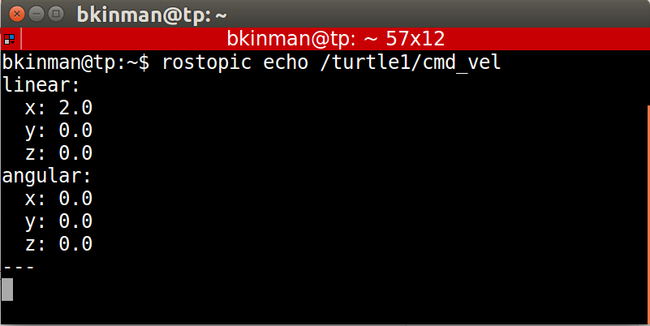

  
In [the next lesson](), we will learn how to build a basic ROS package called simple arm. For real world robotics applications, we will always start by creating a new development workspace and then adding software packages to it, which is exactly what we're going to do in the next lesson.
  

