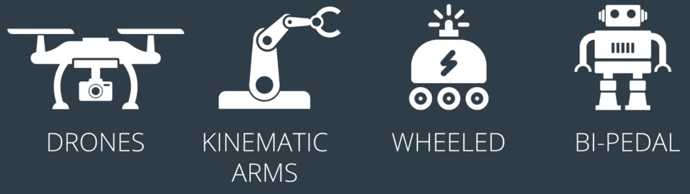

# Introduction

This lesson is all about the Robot Operating System or ROS for short. ROS is widely used across the industry and academia for building robotics applications. ROS is an Open Source Robotics framework that provides libraries and tools for working with hardware and for passing messages between components. ROS also has tools for visualization, simulation and analysis as well as extensive community support and an interface to numerous powerful software libraries. 

# Brief History of ROS

Development of ROS began in the mid-2000s as Project Switchyard in Stanford's Artificial Intelligence Laboratory. In 2007, ROS became a formal entity with support from Willow Garage. Since 2013, the Open Source Robotics Foundation has been maintaining and developing ROS.

  
One of the primary motivations for developing ROS was the recognition that researchers were constantly reinventing the wheel where there were not many reusable robotics software components that could be used as a starting point for a project. In addition, because different groups were all working on custom solutions, it was difficult for them to share code and ideas, It was also difficult to compare results. ROS aims to facilitate the development process by eliminating these problems.

  

